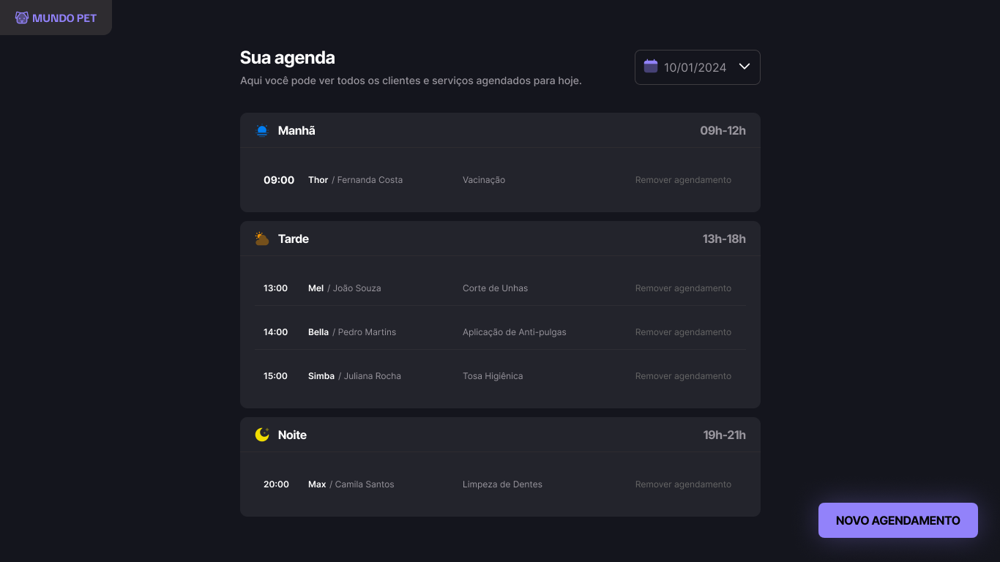
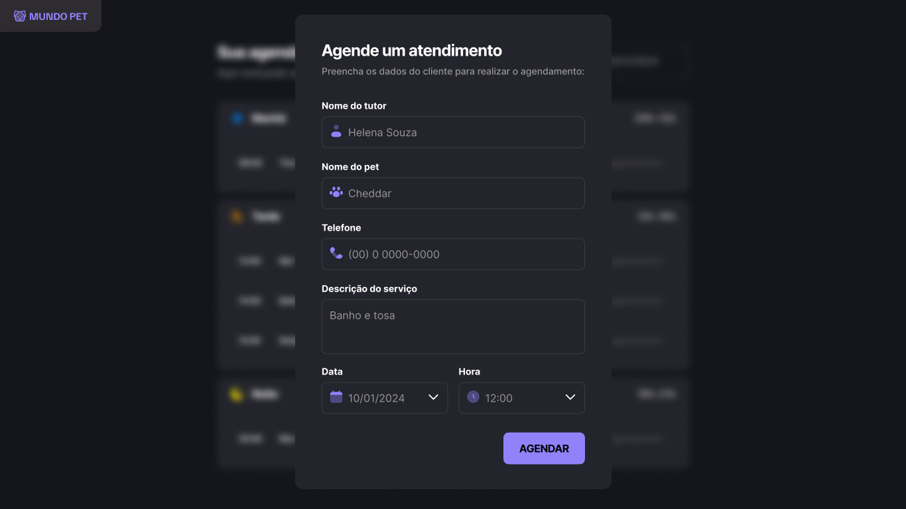

# 🐾 Mundo Pet

Uma aplicação que faz reservas de atendimentos e necessidades veterinárias, salvando na API local. Essa aplicação é mais um dos desafios práticos do módulo Full Stack da Rocketseat.

## 📑 Índice

- [Tecnologias Utilizadas](#️-tecnologias-utilizadas)
- [UI](#-ui)
- [Funcionalidades](#️-funcionalidades)
- [Como Rodar o Projeto](#️-como-rodar-o-projeto)
- [Agradecimentos](#️-fale-comigo)

## 🛠️ Tecnologias Utilizadas

### 🔎 Front-end

- **HTML/CSS** - Design do site e responsividade
- **JavaScript** - Funções, conexão com API e estilização mais avançadas

  

## 📷 UI

## ⚙️ Funcionalidades

- Criar agendamentos
- Apagar agendamentos
- JSON-Server para simular uma REST API local com JSON
- Busca por dias
- Atende à maioria dos dispostivos

## 🚀 Como Rodar o Projeto

- Você precisa ter o **Node.js** e o **npm** instalados para rodar o json-server, que cria um servidor local para o arquivo JSON.

1.  **Clonar o Repositório**

        git clone https://github.com/jefolidev/mundo-pet.git

2.  **Já no diretório do projeto, utilizando o terminal, baixe as dependências**

        git install | yarn install | pnpm install

3.  **Rode o servidor localmente**

    - Execute o seguinte comando no terminal:

           npm run server

4.  **Você pode acessar o front atravès do link abaixo**

- 🔗 Link - [Mundo Pet](https://jefolidev.github.io/mundo-pet/)

## 👥 Fale comigo!

Achou meu repertório interessante e gostaria de contratar um freela ou talvez me contratar para tornar acrescenter no seu negócio? Entre em contato comigo e vamos marcar.

  
  

